# Application Theme

If you want to override some styles across the entire application, you can use a custom theme, leveraging [the Material UI Theming support](https://mui.com/material-ui/customization/theming/). Custom themes let you override colors, fonts, spacing, and even the style of individual components.

The [e-commerce demo](https://marmelab.com/react-admin-demo/) contains a theme switcher, so you can test them in a real application.

<video controls autoplay playsinline muted loop>
  <source src="./img/demo-themes.mp4" type="video/mp4"/>
  Your browser does not support the video tag.
</video>

## Setting The Application Theme

You can override the style of the entire application by passing a custom `theme` to the `<Admin>` component:

```jsx
import { Admin, defaultTheme } from 'react-admin';
import { deepmerge } from '@mui/utils';
import indigo from '@mui/material/colors/indigo';
import pink from '@mui/material/colors/pink';
import red from '@mui/material/colors/red';

const myTheme = deepmerge(defaultTheme, {
    palette: {
        primary: indigo,
        secondary: pink,
        error: red,
        contrastThreshold: 3,
        tonalOffset: 0.2,
    },
    typography: {
        // Use the system font instead of the default Roboto font.
        fontFamily: ['-apple-system', 'BlinkMacSystemFont', '"Segoe UI"', 'Arial', 'sans-serif'].join(','),
    },
});

const App = () => (
    <Admin theme={myTheme}>
        // ...
    </Admin>
);
```

You can either use [built-in themes](#built-in-themes), or [write your own](#writing-a-custom-theme).

Note that you don't need to call Material-UI's `createTheme` yourself. React-admin will do it for you.

## Light And Dark Themes

It's a common practice to support both a light theme and a dark theme in an application, and let users choose which one they prefer.

<video controls autoplay playsinline muted loop>
  <source src="./img/ToggleThemeButton.webm" type="video/webm"/>
  <source src="./img/ToggleThemeButton.mp4" type="video/mp4"/>
  Your browser does not support the video tag.
</video>

React-admin provides a [built-in dark theme by default](#default), the default application theme depends on the user's system settings. If the user has chosen a dark mode in their OS, react-admin will use the dark theme. Otherwise, it will use the light theme.

In addition, users can switch from one theme to the other using [the `<ToggleThemeButton>` component](./ToggleThemeButton.md), that appears in the AppBar as soon as you define a `darkTheme` prop.

You can override the dark theme by setting the `<Admin>`'s `darkTheme` prop with your own theme:

```tsx
import { Admin, defaultDarkTheme, defaultLightTheme } from 'react-admin';
import { deepmerge } from '@mui/utils';

const lightTheme = defaultLightTheme;
const darkTheme = deepmerge(defaultDarkTheme, { palette: { mode: 'dark' } });

const App = () => (
    <Admin
        dataProvider={...}
        theme={lightTheme}
        darkTheme={darkTheme}
    >
        // ...
    </Admin>
);
```

**Tip**: If you don't need the default dark theme, you can set the `<Admin>`'s `darkTheme` prop to `null`:

```tsx
const App = () => (
    <Admin darkTheme={null}>
        // ...
    </Admin>
);
```

## Built-In Themes

React-admin comes with 4 built-in themes, each one having a light and a dark variant. You can use them as a starting point for your custom theme, or use them as-is.

### Default

The default theme is a good fit for every application, and works equally well on desktop and mobile.

[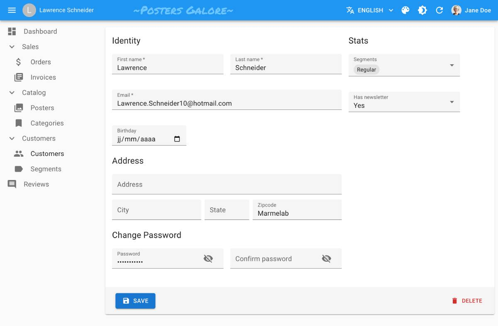](./img/defaultLightTheme1.jpg)
[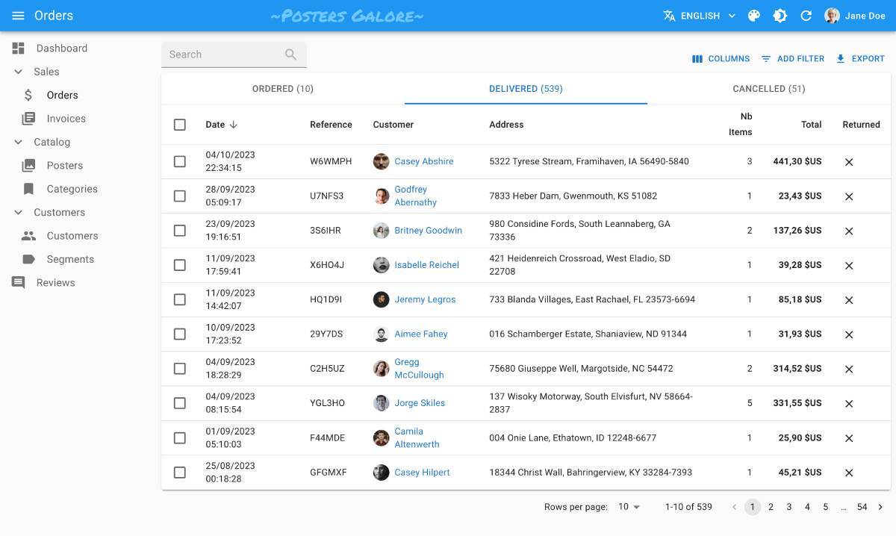](./img/defaultLightTheme2.jpg)
[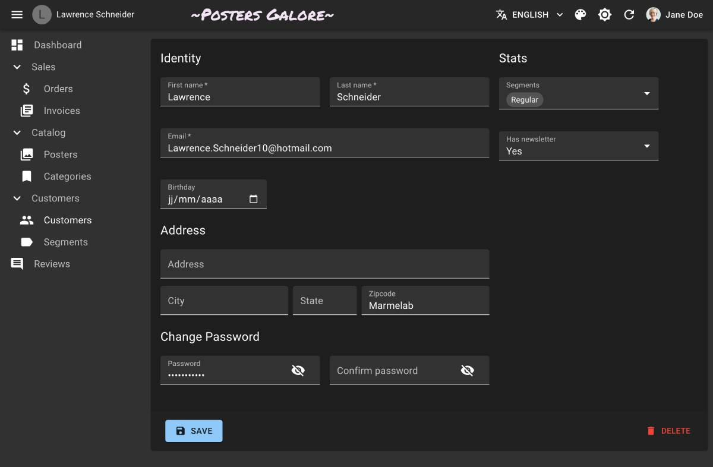](./img/defaultDarkTheme1.jpg)
[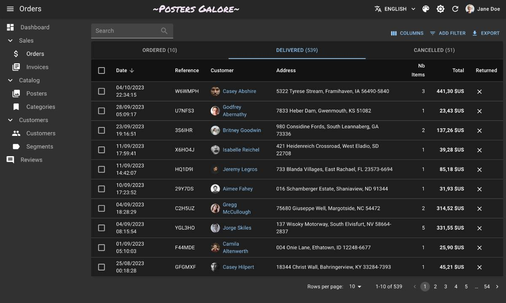](./img/defaultDarkTheme2.jpg)

You don't need to configure anything to use the default theme - it comes out of the box with react-admin.

### Nano

A dense theme with minimal chrome, ideal for complex apps. It uses a small font size, reduced spacing, text buttons, standard variant inputs, pale colors. Only fit for desktop apps.

[](./img/nanoLightTheme1.jpg)
[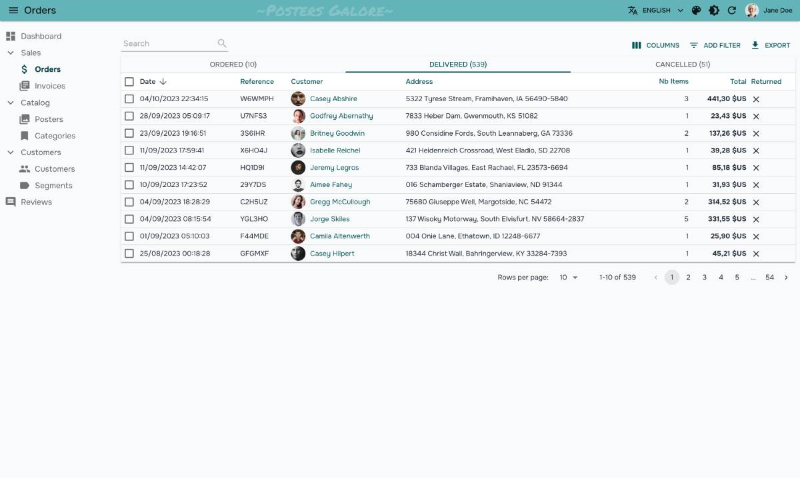](./img/nanoLightTheme2.jpg)
[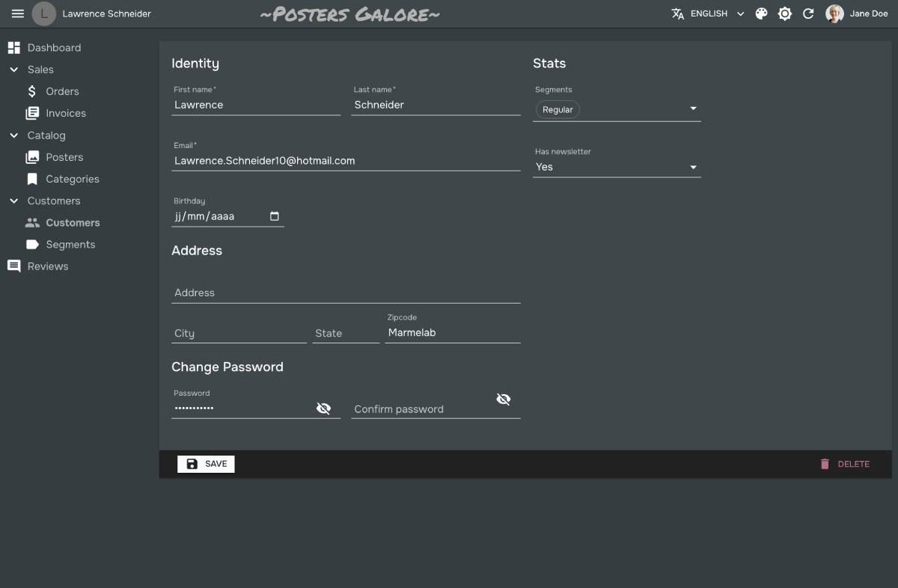](./img/nanoDarkTheme1.jpg)
[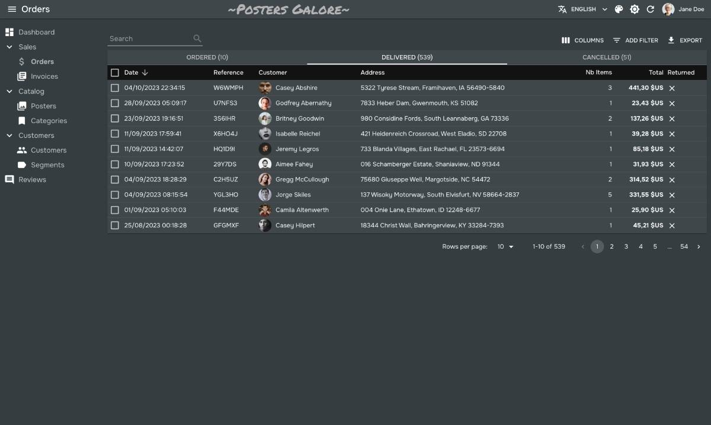](./img/nanoDarkTheme2.jpg)

To use the Nano theme, import the `nanoLightTheme` and `nanoDarkTheme` objects, and pass them to the `<Admin>` component:

```jsx
import { Admin, nanoLightTheme, nanoDarkTheme } from 'react-admin';
import { dataProvider } from './dataProvider';

export const App = () => (
    <Admin
        dataProvider={dataProvider}
        theme={nanoLightTheme}
        darkTheme={nanoDarkTheme}
    >
        // ...
    </Admin>
);
```

You must also import the Onest font in your `index.html` file:

```html
<link href="https://fonts.googleapis.com/css2?family=Onest:wght@300;400;500;700&display=swap" rel="stylesheet">
```

### Radiant

A theme emphasizing clarity and ease of use. It uses generous margins, outlined inputs and buttons, no uppercase, and an acid color palette.

[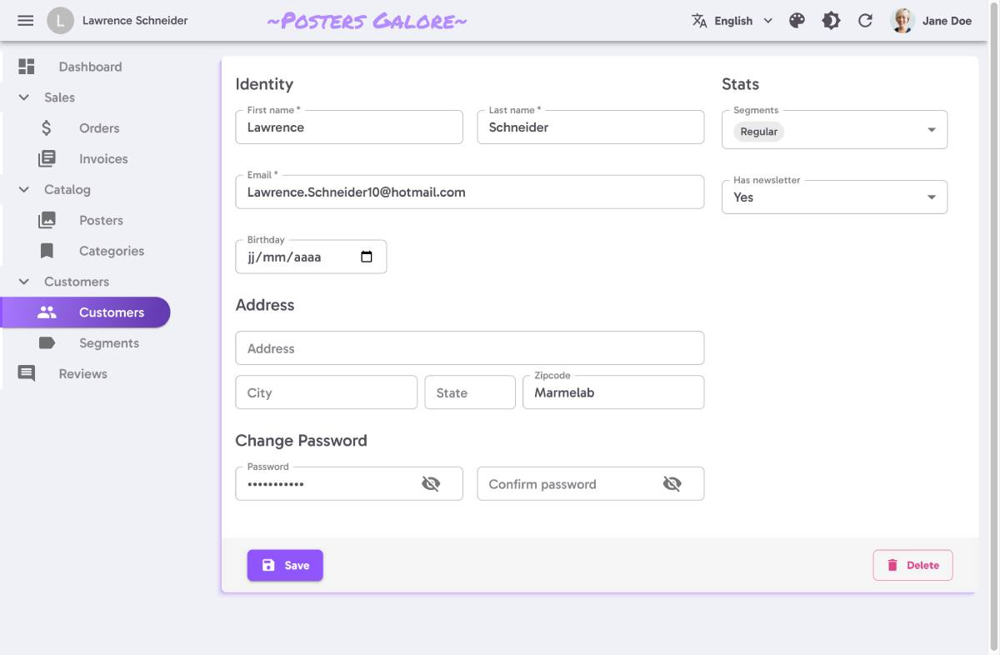](./img/radiantLightTheme1.jpg)
[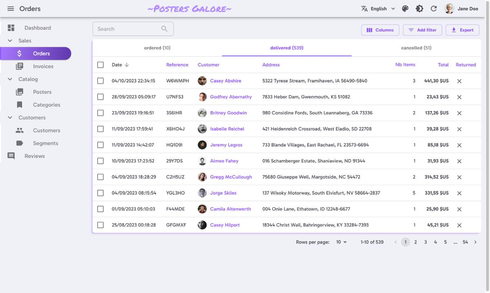](./img/radiantLightTheme2.jpg)
[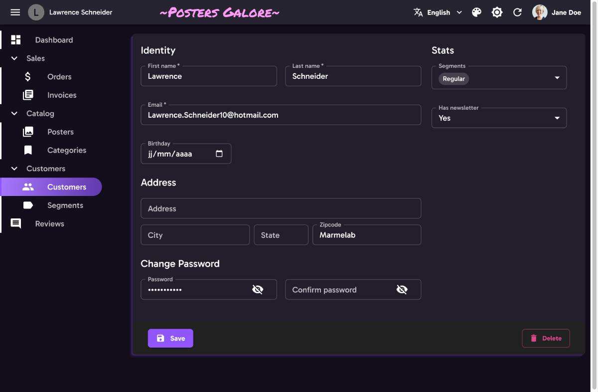](./img/radiantDarkTheme1.jpg)
[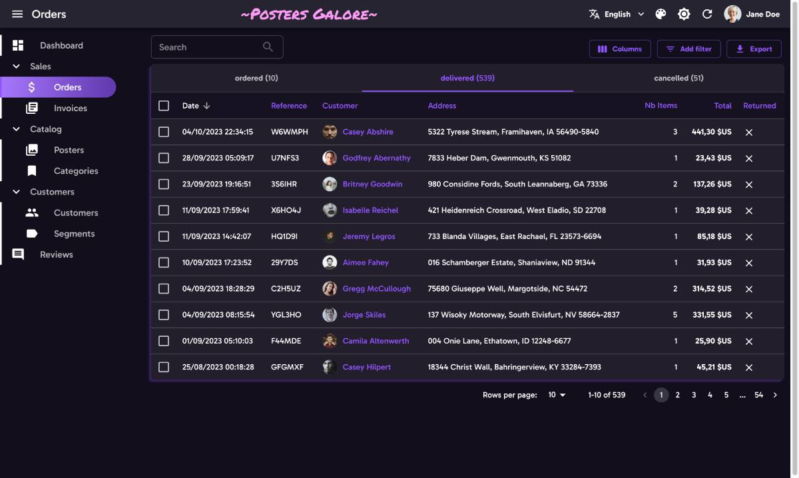](./img/radiantDarkTheme2.jpg)

To use the Radiant theme, import the `radiantLightTheme` and `radiantDarkTheme` objects, and pass them to the `<Admin>` component:

```jsx
import { Admin, radiantLightTheme, radiantDarkTheme } from 'react-admin';
import { dataProvider } from './dataProvider';

export const App = () => (
    <Admin
        dataProvider={dataProvider}
        theme={radiantLightTheme}
        darkTheme={radiantDarkTheme}
    >
        // ...
    </Admin>
);
```

You must also import the Gabarito font in your `index.html` file:

```html
<link href="https://fonts.googleapis.com/css2?family=Gabarito:wght@500;600;700;900&display=swap" rel="stylesheet">
```

### House

A young and joyful theme. It uses rounded corners, blurry backdrop, large padding, and a bright color palette.

[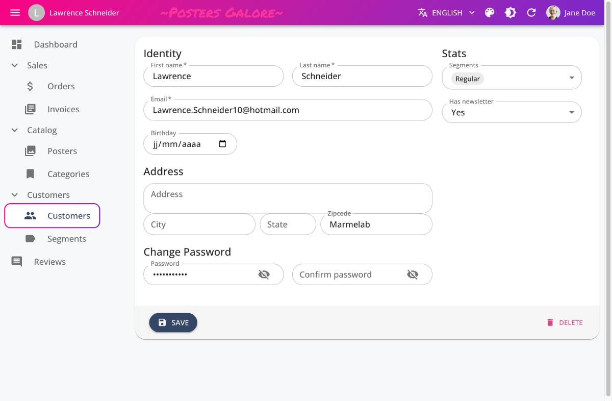](./img/houseLightTheme1.jpg)
[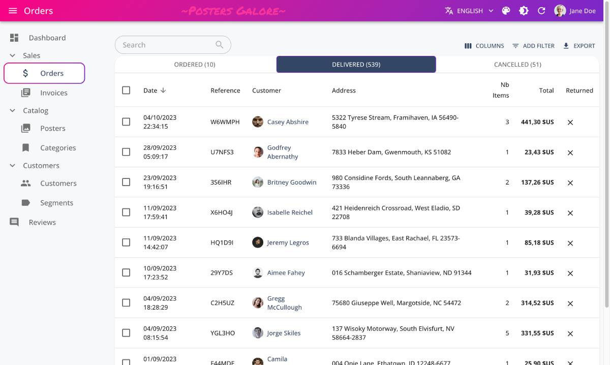](./img/houseLightTheme2.jpg)
[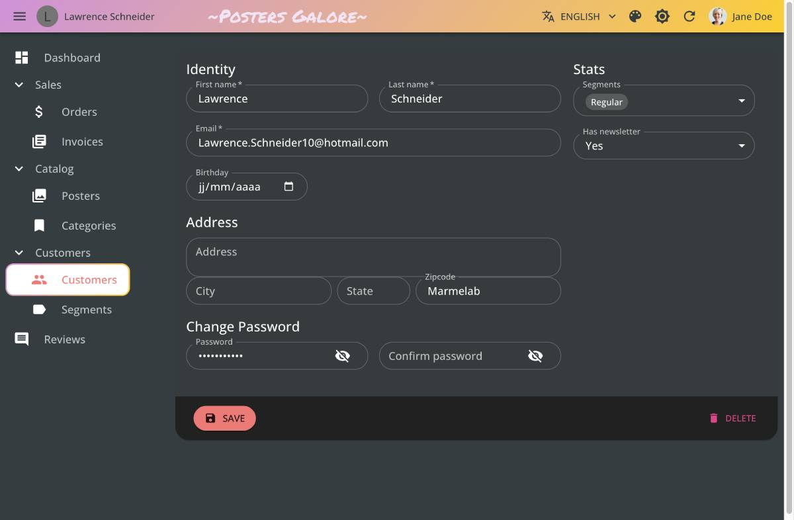](./img/houseDarkTheme1.jpg)
[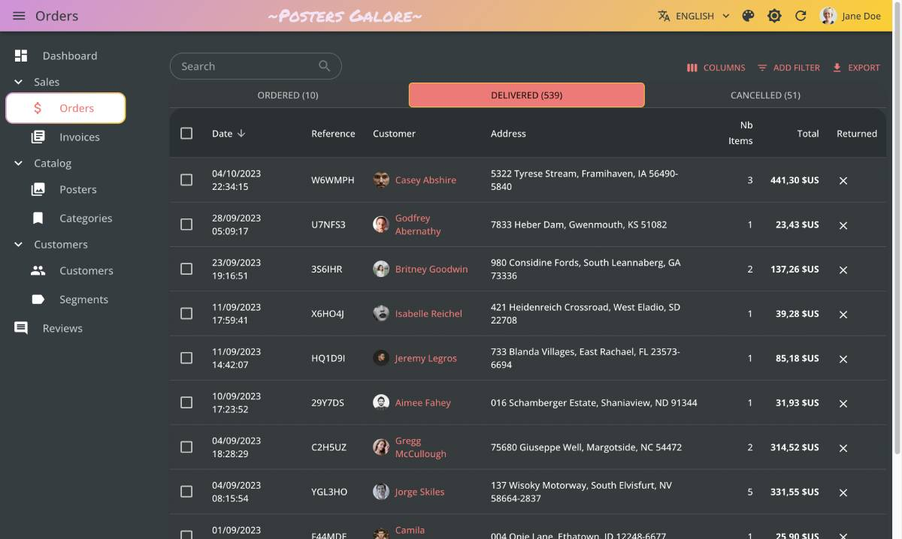](./img/houseDarkTheme2.jpg)

To use the House theme, import the `houseLightTheme` and `houseDarkTheme` objects, and pass them to the `<Admin>` component:

```jsx
import { Admin, houseLightTheme, houseDarkTheme } from 'react-admin';
import { dataProvider } from './dataProvider';

export const App = () => (
    <Admin
        dataProvider={dataProvider}
        theme={houseLightTheme}
        darkTheme={houseDarkTheme}
    >
        // ...
    </Admin>
);
```

You must also import the Open Sans font in your `index.html` file:

```html
<link href="https://fonts.googleapis.com/css2?family=Open+Sans:wght@300;500;600;700&display=swap" rel="stylesheet">
```

## Changing the Theme Programmatically

React-admin provides the `useTheme` hook to read and update the theme programmatically. It uses the same syntax as `useState`. Its used internally by [the `<ToggleThemeButton>` component](./ToggleThemeButton.md).

```jsx
import { defaultTheme, useTheme } from 'react-admin';
import { Button } from '@mui/material';

const ThemeToggler = () => {
    const [theme, setTheme] = useTheme();

    return (
        <Button onClick={() => setTheme(theme === 'dark' ? 'light' : 'dark')}>
            {theme === 'dark' ? 'Switch to light theme' : 'Switch to dark theme'}
        </Button>
    );
}
```

## Theming Individual Components

In a custom theme, you can override the style of a component for the entire application using the `components` key.

For instance, to create a custom theme that overrides the style of the `<Datagrid>` component:

```jsx
import { defaultTheme } from 'react-admin';
import { deepmerge } from '@mui/utils';

const theme = deepmerge(defaultTheme, {
    components: {
        RaDatagrid: {
            styleOverrides: {
              root: {
                  backgroundColor: "Lavender",
                  "& .RaDatagrid-headerCell": {
                      backgroundColor: "MistyRose",
                  },
              }
           }
        }
    }
});

const App = () => (
    <Admin theme={theme}>
        // ...
    </Admin>
);
```

There are 2 important gotchas here:

- Don't forget to merge your custom style overrides with the ones from react-admin's `defaultTheme`, otherwise the application will have the default Material UI theme (most notably, outlined text inputs)
- Custom style overrides must live under a `root` key. Then, the style override syntax is the same as the one used for the [`sx`](./SX.md) prop.

To guess the name of the subclass to use (like `.RaDatagrid-headerCell` above) for customizing a component, you can use the developer tools of your browser, or check the react-admin documentation for individual components (e.g. the [Datagrid CSS documentation](./Datagrid.md#sx-css-api)).

**Tip**: As an alternative, you can also re-export styled components, and use them instead of the react-admin components. Check the [Reusable Components](./SX.md#reusable-components) documentation for an example.

## Overriding Default Props

You can use this technique to override not only styles, but also defaults for components. That's how react-admin applies the `filled` variant to all `TextField` components. So for instance, to change the variant to `outlined`, create a custom theme as follows:

```jsx
import { defaultTheme } from 'react-admin';
import { deepmerge } from '@mui/utils';

const theme = deepmerge(defaultTheme, {
    components: {
        MuiTextField: {
            defaultProps: {
                variant: 'outlined',
            },
        },
        MuiFormControl: {
            defaultProps: {
                variant: 'outlined',
            },
        },
    }
});
```

**Tip**: TypeScript will be picky when overriding the `variant` `defaultProp`. To avoid compilation errors, type the `variant` value as `const`:

```ts
import { defaultTheme } from 'react-admin';
import { deepmerge } from '@mui/utils';

const theme = deepmerge(defaultTheme, {
    components: {
        MuiTextField: {
            defaultProps: {
                variant: 'outlined' as const,
            },
        },
        MuiFormControl: {
            defaultProps: {
                variant: 'outlined' as const,
            },
        },
    }
});
```

## Customizing The Sidebar Width

You can specify the `Sidebar` width by setting the `width` and `closedWidth` properties on your custom Material UI theme:

```jsx
import { defaultTheme } from 'react-admin';
import { deepmerge } from '@mui/utils';

const theme = deepmerge(defaultTheme, {
    sidebar: {
        width: 300, // The default value is 240
        closedWidth: 70, // The default value is 55
    },
});

const App = () => (
    <Admin theme={theme} dataProvider={...}>
        // ...
    </Admin>
);
```

For more advanced sidebar theming, pass your own `Sidebar` component to a custom `Layout`:


```jsx
import { Sidebar, Layout } from 'react-admin';

const MySidebar = (props) => (
    <Sidebar
        sx={{
            "& .RaSidebar-drawerPaper": {
                backgroundColor: "red",
            },
        }}
        {...props}
    />
);

const MyLayout = props => <Layout {...props} sidebar={MySidebar} />
```


## Writing a Custom Theme

Material UI theming also allows to change the default palette, typography, colors, etc. This is very useful to change the react-admin style to match the branding of your company.

A `theme` object can contain the following keys:

* `breakpoints`
* `direction`
* `mixins`
* `components`
* `palette`
* `props`
* `shadows`
* `spacing`
* `transitions`
* `typography`
* `zIndex`

**Tip**: Check [Material UI default theme documentation](https://mui.com/material-ui/customization/default-theme/) to see the default values and meaning for these keys.

```jsx
import { lime, purple } from '@mui/material/colors';

const theme = {
  palette: {
    primary: {
      main: '#FF5733',
      // light: will be calculated from palette.primary.main,
      // dark: will be calculated from palette.primary.main,
      // contrastText: will be calculated to contrast with palette.primary.main
    },
    secondary: {
      main: '#E0C2FF',
      light: '#F5EBFF',
      // dark: will be calculated from palette.secondary.main,
      contrastText: '#47008F',
    },
  },
  spacing: 4,
  typography: {
    fontFamily: 'Raleway, Arial',
  },
  components: {
    MuiCssBaseline: {
      styleOverrides: `
        @font-face {
          font-family: 'Raleway';
          font-style: normal;
          font-display: swap;
          font-weight: 400;
          src: local('Raleway'), local('Raleway-Regular'), url(${RalewayWoff2}) format('woff2');
          unicodeRange: U+0000-00FF, U+0131, U+0152-0153, U+02BB-02BC, U+02C6, U+02DA, U+02DC, U+2000-206F, U+2074, U+20AC, U+2122, U+2191, U+2193, U+2212, U+2215, U+FEFF;
        }
      `,
    },
  },
};
```

Once your theme is defined, pass it to the `<Admin>` component, in the `theme` prop.

```jsx
const App = () => (
    <Admin theme={myTheme} dataProvider={...}>
        // ...
    </Admin>
);
```

You can write a custom theme from scratch, or start from the [default theme](#default-theme) and override some values, using Material UI's utility function deepmerge:

```jsx
import { deepmerge } from '@mui/utils';
import { defaultTheme } from 'react-admin';

const theme = deepmerge(defaultTheme, {
    components: {
        RaDatagrid: {
            styleOverrides: {
              root: {
                  backgroundColor: "Lavender",
                  "& .RaDatagrid-headerCell": {
                      backgroundColor: "MistyRose",
                  },
              }
           }
        }
    }
});
```

## Default Theme

React-admin provides a theme that customizes a few Material-UI settings. You can import and use this react-admin default theme as a starting point for your custom theme:

```jsx
import { defaultTheme } from 'react-admin';
import { deepmerge } from '@mui/utils';

const myTheme = deepmerge(defaultTheme, {
    palette: {
        secondary: {
            main: '#11cb5f',
        },
    },
});
```

Here is the default theme:

```tsx
import { RaThemeOptions } from './types';
import { deepmerge } from '@mui/utils';

const defaultThemeInvariants = {
    typography: {
        h6: {
            fontWeight: 400,
        },
    },
    sidebar: {
        width: 240,
        closedWidth: 50,
    },
    components: {
        MuiAutocomplete: {
            variants: [
                {
                    props: {},
                    style: ({ theme }) => ({
                        [theme.breakpoints.down('sm')]: { width: '100%' },
                    }),
                },
            ],
        },
        MuiTextField: {
            defaultProps: {
                variant: 'filled' as const,
                margin: 'dense' as const,
                size: 'small' as const,
            },
            variants: [
                {
                    props: {},
                    style: ({ theme }) => ({
                        [theme.breakpoints.down('sm')]: { width: '100%' },
                    }),
                },
            ],
        },
        MuiFormControl: {
            defaultProps: {
                variant: 'filled' as const,
                margin: 'dense' as const,
                size: 'small' as const,
            },
        },
    },
};

export const defaultLightTheme: RaThemeOptions = deepmerge(
    defaultThemeInvariants,
    {
        palette: {
            background: {
                default: '#fafafb',
            },
            secondary: {
                light: '#6ec6ff',
                main: '#2196f3',
                dark: '#0069c0',
                contrastText: '#fff',
            },
        },
        components: {
            MuiFilledInput: {
                styleOverrides: {
                    root: {
                        backgroundColor: 'rgba(0, 0, 0, 0.04)',
                        '&$disabled': {
                            backgroundColor: 'rgba(0, 0, 0, 0.04)',
                        },
                    },
                },
            },
        },
    }
);

export const defaultDarkTheme: RaThemeOptions = deepmerge(
    defaultThemeInvariants,
    {
        palette: {
            mode: 'dark',
            primary: {
                main: '#90caf9',
            },
            background: {
                default: '#313131',
            },
        },
    }
);

export const defaultTheme = defaultLightTheme;

```
